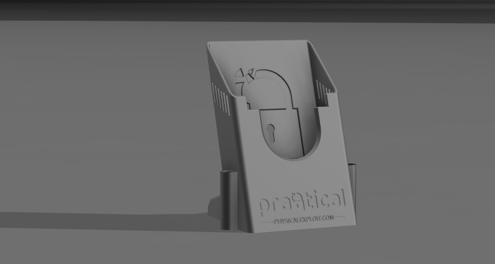
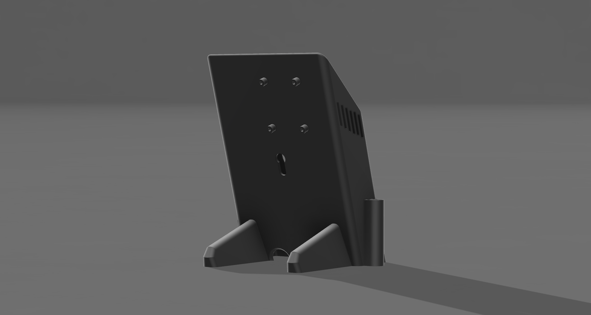

# HackRF H4M Desktop Stand

## Overview

This is a free 3D-printable desktop stand designed specifically for the OpenSourceSDRLab H4M Spectrum Analyzer and Receiver. The stand provides an ergonomic viewing angle for desktop operation while protecting your device and improving usability.

## Features

- **Ergonomic Design**: Positions your H4M at the optimal angle for desktop viewing and operation
- **Ventilation Slots**: Side ventilation ensures proper airflow during extended operation
- **Amplifier Compatibility**: Includes mounting holes on the back specifically designed for the OpenSourceSDRLab amplifier
- **Stable Base**: Weighted design prevents tipping when operating the touch screen or knob controls
- **Cable Management**: Open bottom design allows for clean cable routing
- **Durable Construction**: Made from sturdy material for long-term use

## Compatibility

- OpenSourceSDRLab H4M Receiver and Spectrum Analyzer
- Compatible with all H4M bundles and configurations
- Mounting holes designed specifically for OpenSourceSDRLab amplifier accessories

## Printing Instructions

1. Download the STL / STEP
2. Print with your 3D printer

## Installation

1. Place your H4M device into the stand with the screen facing forward
2. For amplifier mounting, use M3 screws (not included) to attach the amplifier to the mounting holes on the back

## Attribution

This stand was designed by [Practical Physical Exploitation](https://physicalexploit.com) and is provided free for the HackRF community.

## License

This design is released under the [Creative Commons Attribution 4.0 International License](https://creativecommons.org/licenses/by/4.0/).

## Additional Resources

- [OpenSourceSDRLab H4M Product Page](https://opensourcesdrlab.com/products/h4m-receiver-and-spectrum-analyzer)
- [HackRF Documentation](https://hackrf.readthedocs.io/)
